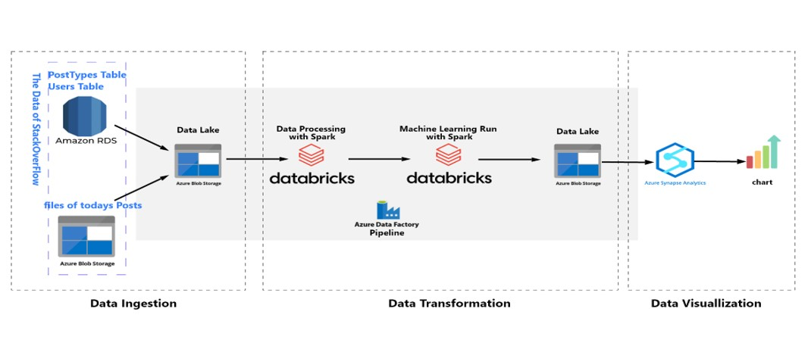
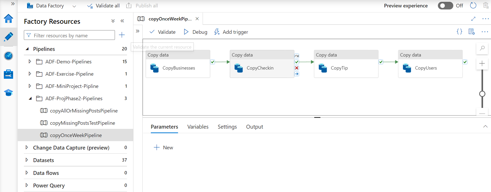
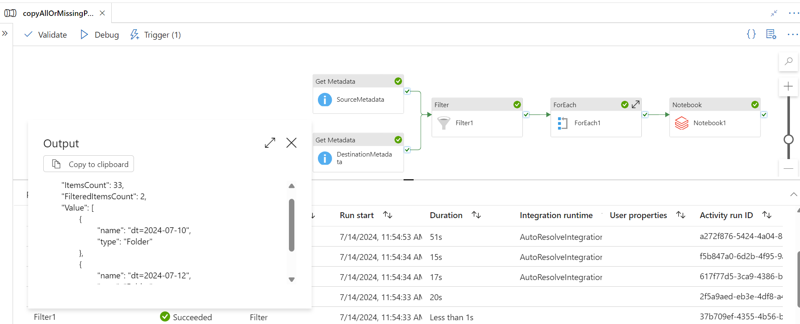
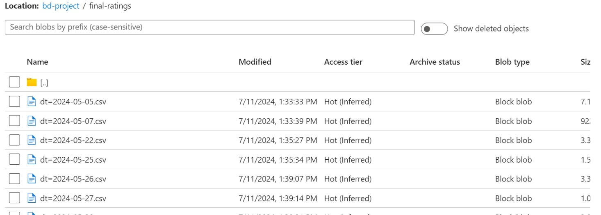
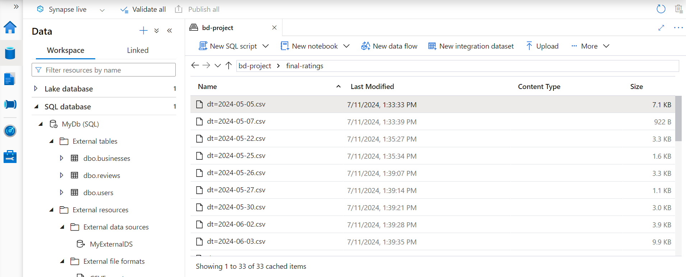

# WCD Phase 2: Data Lake Project on Azure

## Overview

The WCD Phase 2 Project showcases data engineering using a Data Lake architecture on the Azure platform with Yelp data. It ingests data from two sources and stores it in Azure Data Lake Storage. Selected data from the Data Lake is then processed through a machine learning algorithm, resulting in transformed data that is also stored in the Data Lake. This transformed data will be integrated with other datasets in Azure Synapse for analytics and reporting.

## Project Stages

The project is divided into four stages:

- [1: Storage Mount](#1-storage-mount)
- [2: Model Training](#2-model-training)
- [3: Data Ingestion and Transformation in a Workflow](#3-data-ingestion-and-transformation-in-a-workflow)
- [4: Data Analytics](#4-data-analytics)

## Extra Information

- [Technologies](#technologies)
- [Acknowledgements](#acknowledgements)

 

<i>Below is the project architecture diagram outlining system's components and 
data flow:</i>

 

 

### 1: Storage Mount

In this stage, an Azure Storage Account with hierarchical namespace enabled is created. A container with multiple directories is set up within the Storage Account for project use. The Storage Account is then mounted with Azure Databricks, making the stored data accessible for the project. For details on the mounting code, refer to the [Mount Storage container.ipynb](adb/Mount%20Storage%20container.ipynb) notebook.

 

  [Back to Project Stages](#project-stages) &nbsp; [Back to Top](#overview)

 

### 2: Model Training
In this stage, a machine learning model using the Logistic Regression algorithm is developed and trained with the provided training dataset in parquet format, to generate predictions and ratings. Once training is complete, the resulting model object is stored in an Azure Data Lake container for future use. For details on the model training code, refer to [Yelp Model Training.ipynb](adb/Yelp%20Model%20Training.ipynb) and [Yelp Model Training EDA.ipynb](adb/Yelp%20Model%20Training%20EDA.ipynb) notebook shows code on preliminary data exploration.

 

  [Back to Project Stages](#project-stages) &nbsp; [Back to Top](#overview)

 

### 3: Data Ingestion and Transformation in a Workflow
The third stage focuses on data ingestion and transformation within a Workflow:
- **Data Sources**: Data is ingested from two distinct sources into Azure Data Lake 
containers using Azure Data Factory. 
  - **Weekly Source**: Data is ingested weekly from four tables within a PostgreSQL relational database hosted in AWS. The data is saved in CSV format to four folders in Azure Data Lake, named after the corresponding PostgreSQL tables. The table names are: Businesses, Checkin, Tip, and Users. 

   

  <i>See screenshot of weekly ingestion in Azure Data Factory below</i>

   

  
  
   

  - **Daily Source**: Yelp review data is ingested daily from WeCloudData's public storage blob, with each folder named by the date in the format dt=Year-month-day. The data is ingested using Azure Data Factory on an incremental basis and then copied to the sink (destination) while maintaining the same folder structure, file format, and naming convention. 
   
  <i>See screenshot of daily ingestion in Azure Data Factory below</i>

   

  

   

- **Transformation in a Workflow**: The ingested daily Yelp review data undergoes transformations in an Azure Databricks notebook, initiated by a daily trigger within the Azure Databricks Workflows engine. During the Workflow run, the transformed data is processed using the saved and trained machine learning model from Stage 2 to generate predictions and ratings in CSV format. All output CSV files are stored in a single Azure Data Lake folder called "final-ratings," with each file named according to the source folder in the format dt=Year-month-day.csv. For details on the transformation and workflow, refer to the daily ingestion screenshot above and [Model Deployment](adb/Model%20Deployment_Incremental.ipynb) notebook. 

 

  [Back to Project Stages](#project-stages) &nbsp; [Back to Top](#overview)

 

<i>For a look into the tranformation output folder, see </i> 

 

- ### 4: Data Analytics 
The last stage focuses on deriving insights from the combined data in the transformation output folder and all output folders from the weekly ingested data sources in Stage 3. This is accomplished using Azure Synapse Serverless SQL pool for data analytics and reporting. For details, refer to the folder [Synapse Query and Output](./synapse_powerbi/Analytics_Qry_Output/) for sample Azure Synapse analytics queries and output screenshots. Further analytics and visualization are implemented with these datasets in Power BI. See [Power BI screenshots in PDF format](synapse_powerbi/PowerBIScreenshots.pdf).

Power BI screenshot extract below:

 

 

For details on the Azure Synapse setup code, refer to the [Synapse Deployment Script](synapse_powerbi/SynapseExternalTablesDeploymentScript.sql) notebook.

 

<i>See the Azure Synapse environment below </i>
 

 

  [Back to Project Stages](#project-stages) &nbsp; [Back to Top](#overview)

 

## Technologies

- **Azure Data Lake Storage**
- **Azure Data Factory**
- **Azure Databricks**
- **Azure Synapse**
- **PowerBI Desktop**

 

## Acknowledgements
Thanks to the WeCloudData team for their support and collaboration throughout this project.

 

  [Back to Project Stages](#project-stages) &nbsp; [Back to Top](#overview)

