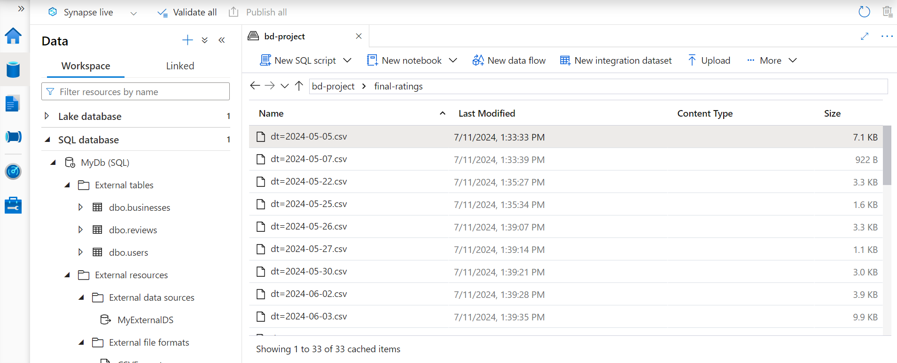

# WCD Phase 2: Data Lake Project on Azure

## Overview

The WCD Phase 2 Project demonstrates data engineering utilizing a Data Lake architecture on the Azure platform, leveraging Yelp data. It ingests data from two distinct sources and stores it in Azure Data Lake Storage. Data from one of these sources is processed through a machine learning algorithm, which results in transformed data that is also stored in the Azure Data Lake Storage. This transformed data is then integrated with the data from the second source within Azure Synapse, enabling advanced analytics and reporting.

## Project Phases

The project will be discussed under the sections below:

- [Storage Mount](#1-storage-mount)
- [Model Training](#2-model-training)
- [Ingestion](#3-ingestion)
- [Transformations](#4-transformations)
- [Analytics and Visualizations](#5-analytics-and-visualizations)

## Extra Information

- [Technologies](#technologies)
- [Acknowledgements](#acknowledgements)

 

<i>Below is the project architecture diagram outlining system's components and 
data flow:</i>

 

 

### 1: Storage Mount

In this stage, an Azure Storage Account with hierarchical namespace enabled is created. A container with multiple directories is set up within the Storage Account for project use. The Storage Account is then mounted with Azure Databricks, making the stored data accessible for the project. For details on the mounting code, refer to the [Mount Storage container](adb/Mount%20Storage%20container.ipynb) notebook.

 

  [Back to Top](#overview)

 

### 2: Model Training
In this stage, a machine learning model using the Logistic Regression algorithm is developed and trained with the provided training dataset in parquet format, to generate predictions and ratings. Once training is complete, the resulting model object is stored in an Azure Data Lake container for future use. For details on the model training code, refer to [Yelp Model Training](adb/Yelp%20Model%20Training.ipynb). The [Yelp Model Training EDA](adb/Yelp%20Model%20Training%20EDA.ipynb) notebook shows code on preliminary data exploration.

 

  [Back to Top](#overview)

 

### 3: Ingestion
The third stage focuses on data ingestion. 

**Data Sources**: Data is ingested from two sources into Azure Data Lake Storage containers using two Azure Data Factory pipelines. The two sources are:

  - **Weekly Source**: One of the Azure Data Factory pipelines ingests data from four tables in a PostgreSQL relational database hosted in AWS RDS to Azure Data Lake Storage. This process is triggered by a scheduler, which runs on a weekly basis to incrementally ingest new data. The data is saved in CSV format across four folders in Azure Data Lake Storage, with each folder named after the corresponding PostgreSQL table. The table names are: Businesses, Checkin, Tip, and Users.

  
   

  <i>See screenshot of weekly ingestion in Azure Data Factory below</i>

   

  
  
   

  - **Daily Source**: The second Azure Data Factory pipeline ingests daily Yelp review data from WeCloudData's public blob storage in the cloud into Azure Data Lake Storage. A scheduler triggers the pipeline to run daily, ensuring the incremental ingestion of new data. The data in the public blob storage is organized into folders, with each day data in a folder named using the format `dt=Year-month-day`. This folder structure, along with the file format and naming conventions, is preserved when the data is copied to Azure Data Lake Storage.

   
  <i>See screenshot of daily ingestion in Azure Data Factory below</i>

   

  

 

  [Back to Top](#overview)

 

### 4: Transformations
The transformation phase consists of the first and second stage transformations within the Azure Databricks notebook. This notebook is part of the Azure Data Factory pipeline workflow. The pipeline is triggered to execute daily at a specified time. Once ingestion is completed within the pipeline, it automatically invokes the Databricks notebook, which then performs the first and second stage transformations consecutively. For an overview of the entire process, refer to the [project architecture diagram](screenshots/projarchy.png).

- **First Stage Transformation**
  
  In the first stage of transformations, the daily Yelp review data, stored in the Azure Data Lake Storage container during the ingestion phase as a series of folders, each named with the format `dt=Year-month-day`, is read into a dataframe one folder at a time. While multiple folders may be processed in a single day, only one day's folder is read into a dataframe at a time. Each day's dataframe then undergoes the first stage of transformations, which include converting the text to lowercase, removing extra spaces, and eliminating non-alphabetic characters, all performed through Azure Databricks.

- **Second Stage Transformation**

  In the second stage of transformations, the dataframe from the first stage is further processed. This involves applying the Azure Databricks trained and saved machine learning model (described in the [Model Training](#2-model-training) section). As a result, predictions and star ratings columns are added to the dataframe once the second stage transformations are complete.

  After the second stage transformation for each specific date is completed, the transformed output for that date, representing the dataframe after the second stage processing, is saved as a CSV file with the format `dt=Year-month-day.csv` in the "final-ratings" folder in Azure Data Lake Storage.

  For further details on the transformation process and workflow, refer to the [daily ingestion screenshot](adf/adf_screenshots/copyAllOrMissingPostsPipeline_Incremental.png) and the [Model Deployment](adb/Model%20Deployment_Incremental.ipynb) notebook.
  
  <i>For a look into the tranformation output folder, see </i> 

 

  [Back to Top](#overview)

 

### 5: Analytics and Visualizations
The last stage focuses on deriving insights from the combined data in the final-ratings folder and all output folders from the weekly ingested data sources in Stage 3. This is accomplished using Azure Synapse Serverless SQL pool for data analytics and reporting. For details, refer to the folder [Synapse Query and Output](./synapse_powerbi/Analytics_Qry_Output/) for sample Azure Synapse analytics queries and output screenshots. Further analytics and visualizations are implemented with these datasets in Power BI. See [Power BI screenshots in PDF format](synapse_powerbi/PowerBIScreenshots.pdf).

Power BI screenshot extract below:

 

 

For details on the Azure Synapse setup code, refer to the [Synapse Deployment Script](synapse_powerbi/SynapseExternalTablesDeploymentScript.sql) notebook.

 

<i>See the Azure Synapse environment below </i>
 

 

  [Back to Top](#overview)

 

## Technologies

- **Azure Data Lake Storage**
- **Azure Data Factory**
- **Azure Databricks**
- **Azure Synapse**
- **PowerBI Desktop**

 

## Acknowledgements
Thanks to the WeCloudData team for their support and collaboration throughout this project.

 

  [Back to Top](#overview)

